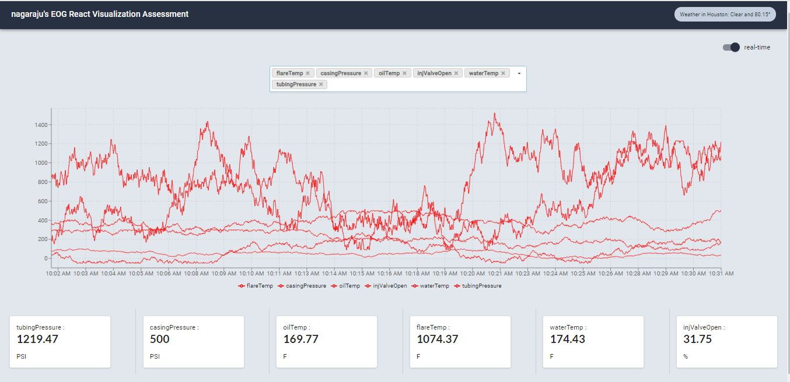

## Create React App Visualization

This assessment was bespoke handcrafted for Nagaraju.
Run yarn install  
Run yarn start 
go to "http://localhost:3000/"
 
Tool used: React v16.9, Recharts, React Hook, react-redux, subscriptions-transport-ws, urql, material UI, semantic UI,

Read more about this assessment [here](https://react.eogresources.com)

